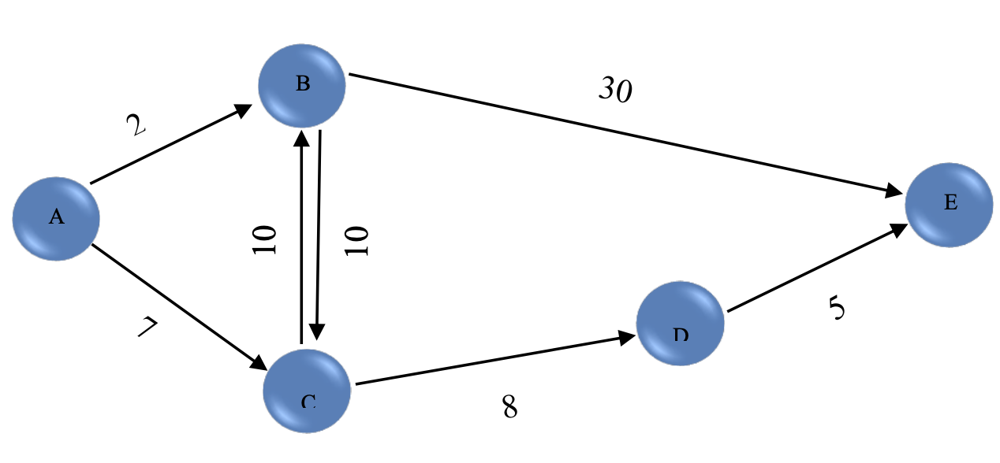
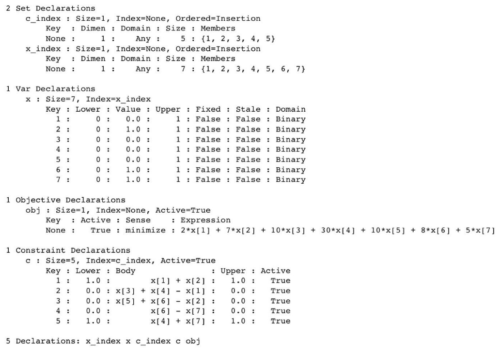

# Optimization with Linear Programming 
Some practical application of linear programming in optimization problems using Pyomo

# Problem 1: Investment Optimization with Linear Programming

In this part, we find the shortest distance between the origin (A) and the destination (E) using linear programming:

First we model the problem to a Linear Programming problem:

The size of each side is the constraint for the xi corresponding to that side. The xi for each side, gets a value of 0 or ,1 and demonstrates whether or not that side is in the path.

- X1: AB = 2 
- X2 : AC = 7
- X3:BC= 10
- X4: BE= 30
- X5: CB = 10
- X6: CD = 8
- X7: DE = 5

  Starting from A, it has to choose AB or AC (×1+×2= 1)

  If it chooses AB, it has to choose BC or BE next.

  If it chooses AC, it has to choose CB or CD next.

  If it chooses CD, it will have to choose DE to reach the destination.

  Finally, it has to choose between BE or DE to get to E. (×4+×7 = 1)

  Here are the results:

  

min distance= 20.0

# Problem 2: Investment Optimization with Linear Programming

In this project, we solve a linear programming problem related to optimal investment in two entrepreneurial ventures. You are given the opportunity to invest $6000 in two different businesses, each requiring both cash and time commitment. Each venture offers flexibility, allowing you to invest any proportion of a full partnership. The goal is to maximize your total estimated profit while managing your time and financial constraints.

## Problem Overview

Specifically, this problem involves:

- **Venture 1:** Requires $5000 and 400 hours for full partnership with an estimated profit of $4500.
- **Venture 2:** Requires $4000 and 500 hours for full partnership with an estimated profit of $4500.

You can allocate a portion of your funds and time to either or both ventures, subject to the following constraints:

- **Maximum available capital:** $6000
- **Maximum available time:** 600 hours

## Solution Approach

Using linear programming methods (Pyomo), we model (define objective functions and constraints) and solve the problem to find the best investment strategy that maximizes total profit. 

The results are as below:

# Problem 3: Optimizing Triangle Perimeter Using Linear Programming

We consider a given triangle with sides:
(1 + x), (7 + x - 1.5y), (8 - x - 0.5y)

We determine the sides of the triangle using Linear Programming with the Pyomo package such that:

1. The **perimeter** of the triangle is maximized.

   The results are as below:

3. The **perimeter** of the triangle is minimized.

   The results are as below:

# Problem 4: Linear Programming for Minimizing Manhattan Distance

An online store aims to set up a city-based delivery center for in-person order pickups. The goal is to minimize the total distance from the center to all customer locations, calculated using the Manhattan distance formula.

## Problem Overview

Given:
- A list of customer coordinates `(x, y)`.

Objective:
- Find the optimal location for the delivery center such that the sum of Manhattan distances from all customers to the center is minimized.

## Solution Approach

### Inputs

1. **Number of Customers (`n`):** An integer representing the total number of customers.
2. **Customer Coordinates:** For each customer, provide coordinates `(x, y)`.

### Model

The optimization problem is formulated and solved using the Pyomo package with the following steps:

1. **Variables:**
   - `model.x`: x-coordinate of the delivery center.
   - `model.y`: y-coordinate of the delivery center.
   - `model.new_var`: Auxiliary variables used to handle constraints.

2. **Constraints:**
   - Define constraints to ensure that the Manhattan distance from each customer to the center is accounted for.

3. **Objective:**
   - Minimize the sum of the distances from all customers to the delivery center.

4. **Solver:**
   - Use GLPK to solve the linear programming problem.
  
For an aribtrary input:

3 
  

(2, 5)

(3, 3)

(3, 5)

The results are as below:

